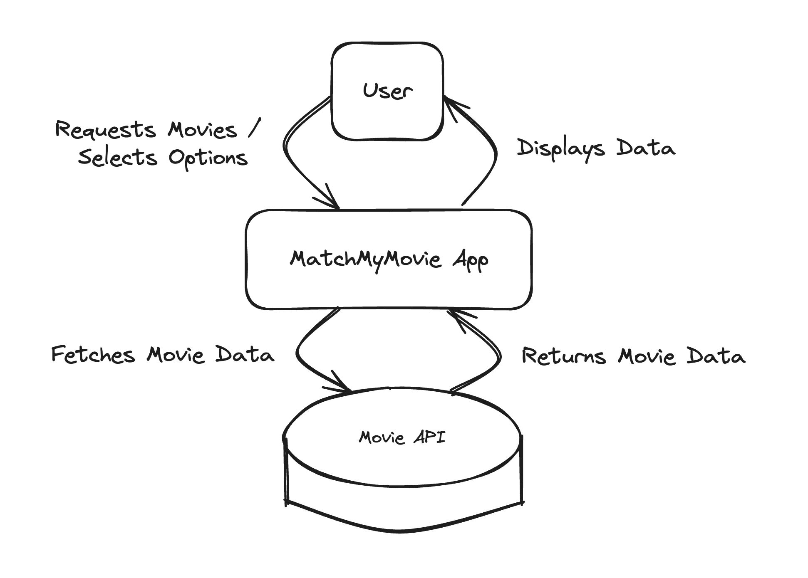
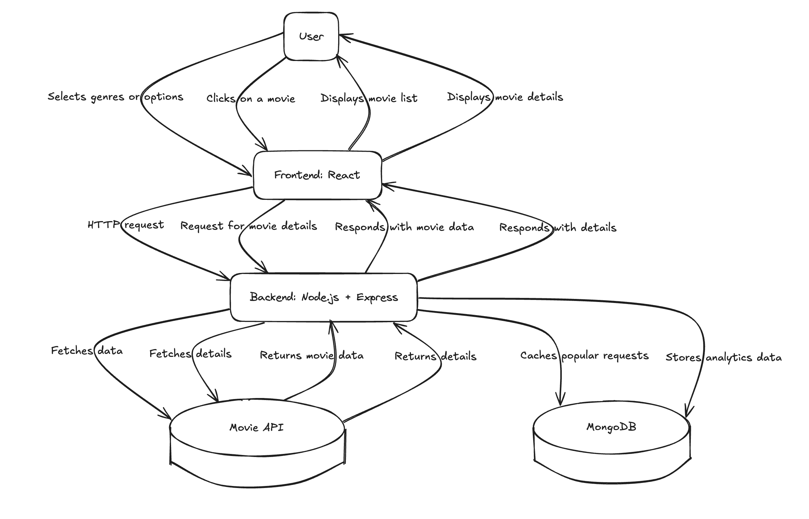
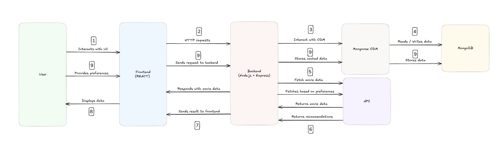
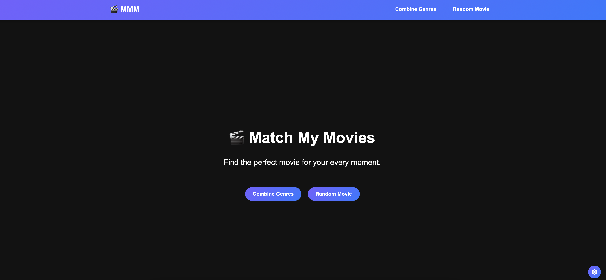
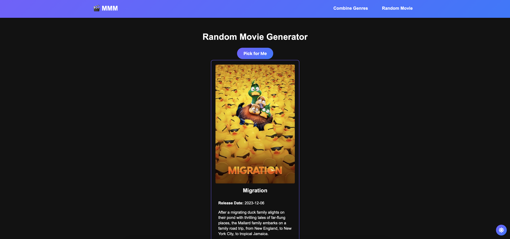
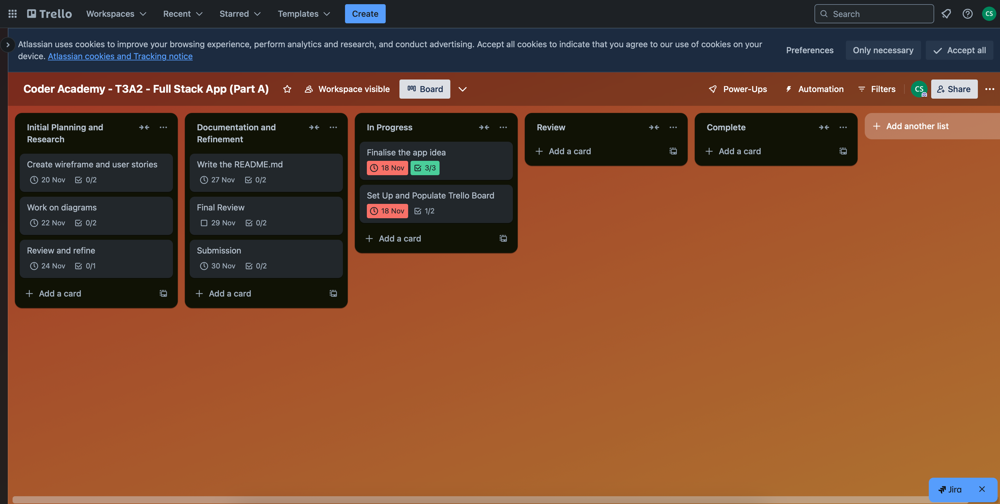
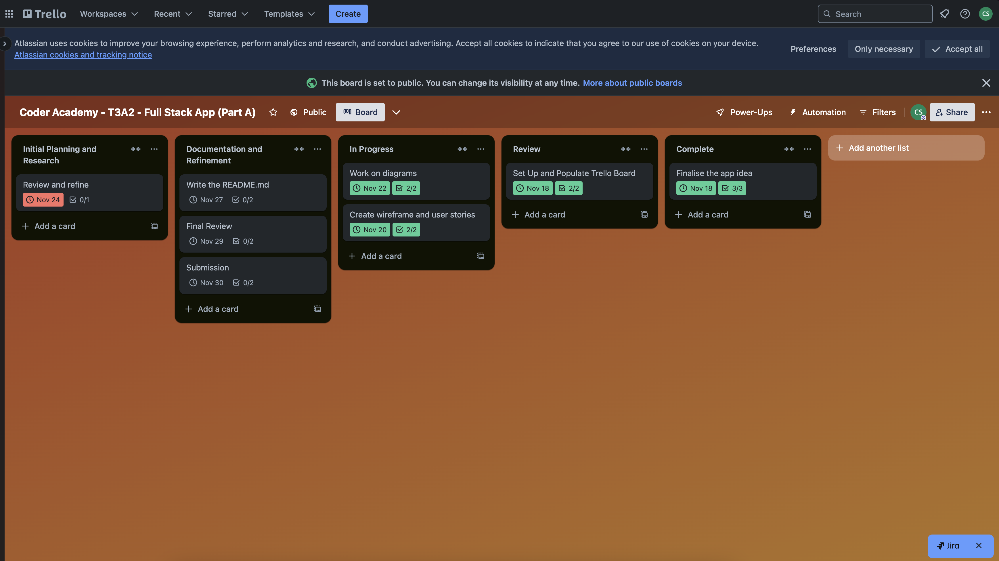
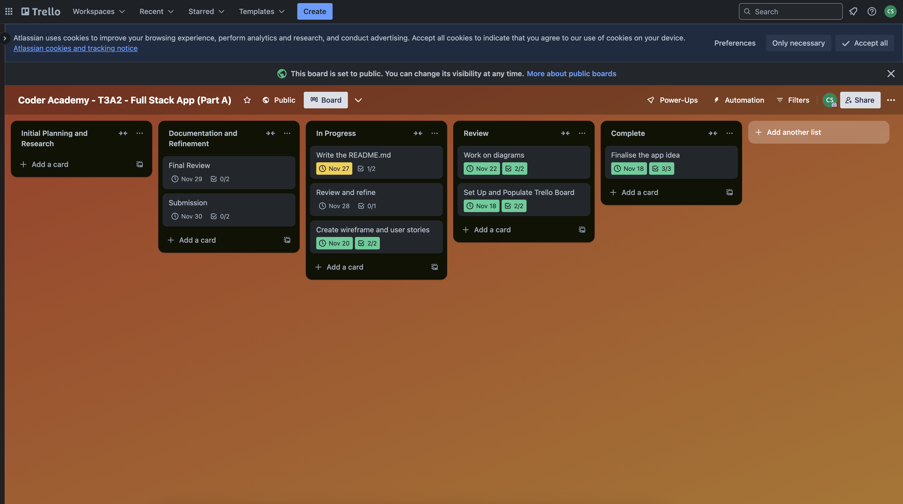
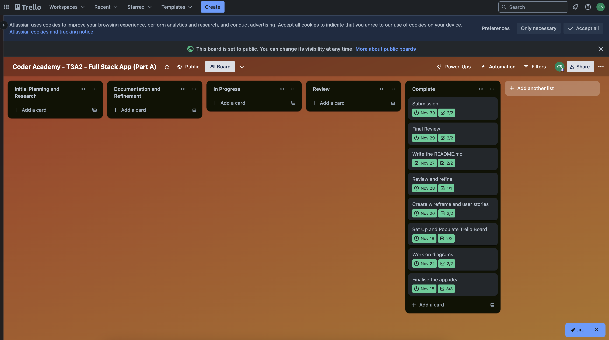

# Match My Movies (MMM)

Match My Movies (MMM) is a web application designed to help users discover the perfect movie for any mood or occasion. This app allows users to combine genres or get a random movie recommendation, solving the problem of decision fatigue when choosing a movie.

## Deployed Application

Access the live application here: [Match My Movies](https://matchmymovies.com)

## GitHub Repository

View the repository: [MMM GitHub Repo](https://github.com/Match-My-Movies)

## Features

- **Genre Combiner**: Select two genres to get tailored movie recommendations.
- **Random Movie Generator**: Allow MMM to pick a random movie for you.
- **Expandable Movie Cards**: View detailed movie information by expanding cards.
- **Light/Dark Theme Toggle**: Customize the appearance of the app to your preference.

## Technologies

- **Frontend**: React
- **Backend**: Node.js, Express
- **Database**: MongoDB Atlas
- **Libraries**: Axios, React Router, Vanila CSS
- **Deployment**: Netlify, Render
- **Test**: Insomnia

## User Stories
- As a user, I want to combine two genres to find movies matching both.
- As a user, I want a random movie suggestion.
- As a user, I want a visually appealing and easy-to-navigate interface.

## Acknowledgements
- **Educators**: For guidance and support.
- **TMDB API**: The movie data source for this project.

## Dataflow Diagram

## Application Architecture Diagram

## Screenshots
### Home Page

### Genre Combiner

### Random Movie Generator

## Planning
### Trello Boards

